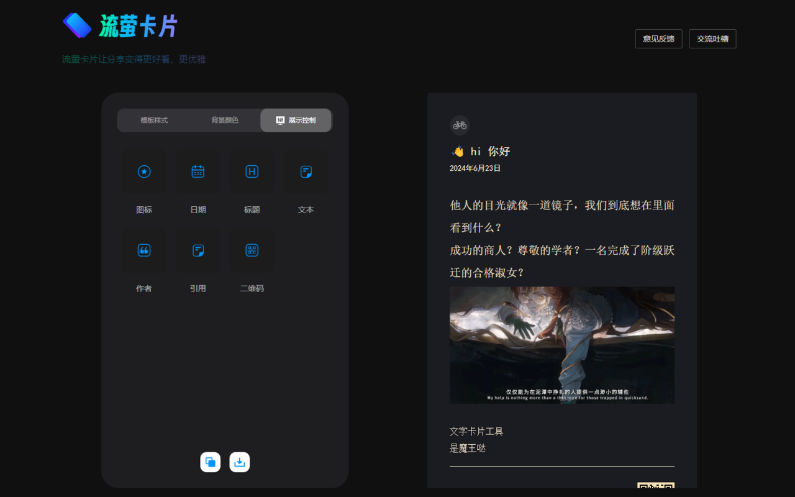
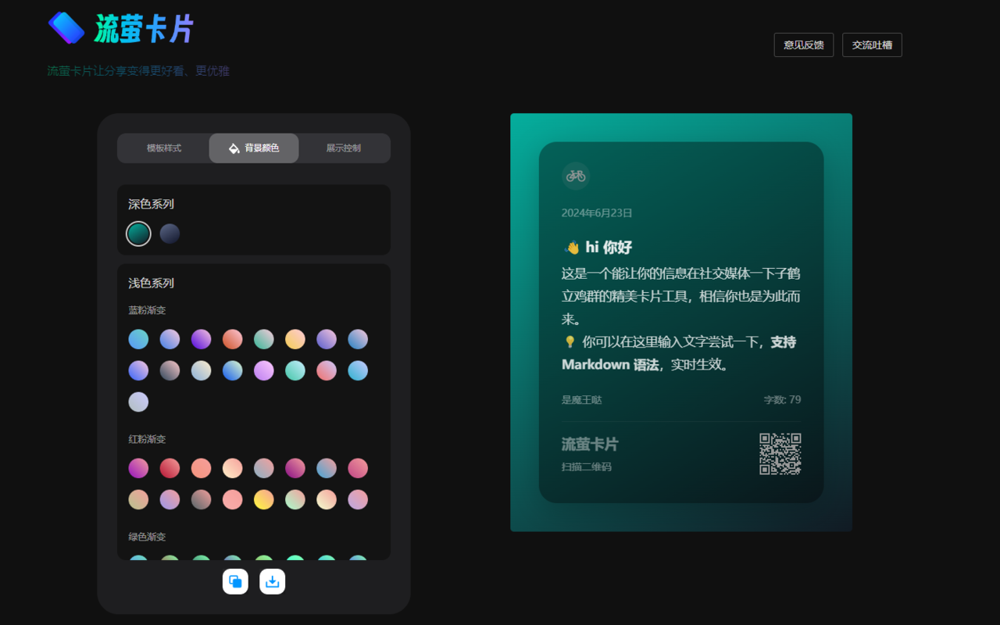
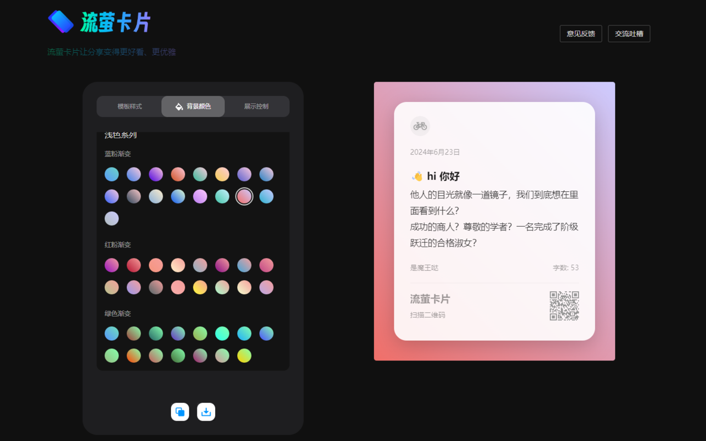
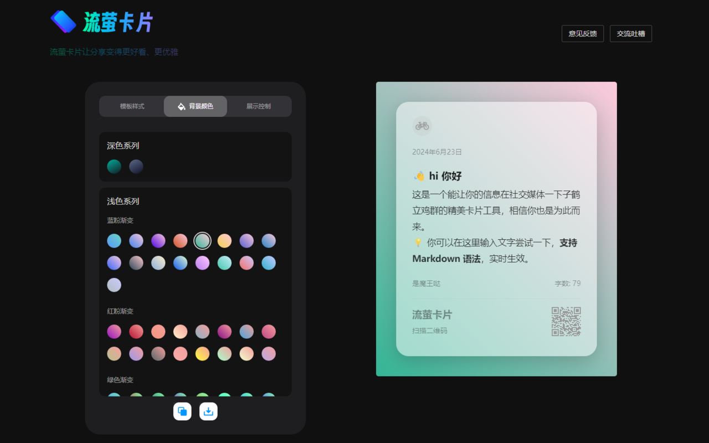
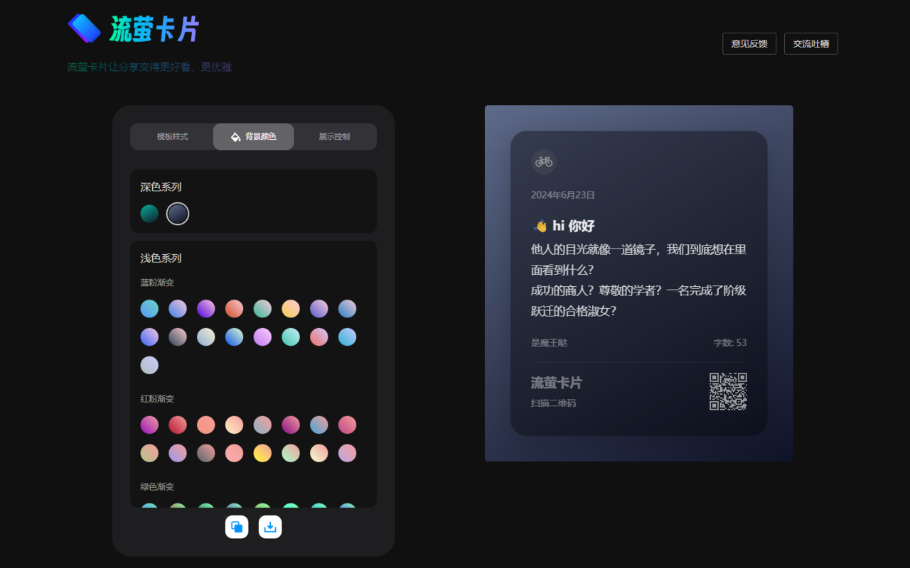

## 📚流光卡片Chrome插件：一键美化文字

简单而强大的开源Chrome插件，让文字分享变得优雅。

🔗 流光卡片网页：https://fireflycard.shushiai.com/

🔗 流光卡片 Google 插件 Gitee：https://gitee.com/hzymy/firefly_card_google

🔗 流光卡片 Google 插件 GitHub：https://github.com/someone1128/firefly_card_google

🔗 Youtube 演示地址：https://www.youtube.com/watch?v=H8le6asUqkw

## 🎨为什么我们选择开源插件？

1. 加速使用：插件正在审核中，但我们迫不及待想让您体验这款神奇工具。
2. 拥抱社区：我们相信开源的力量，期待您的贡献和反馈。
3. 提升可见度：让更多人发现流光卡片的魅力。

## ✨ 核心功能：

1. **[MD语法支持]** —— 释放您的创造力，自由编辑，让文字与图片完美融合。
2. **[内容展示]** —— 灵活选择，信息展示随心所欲，无水印干扰，纯净分享。
3. **[背景美化]** —— 多种颜色和渐变效果，让每一张卡片都成为视觉焦点。
4. **[Web网页编辑]** —— 随时随地，编辑更便捷，分享更迅速。
5. **[Google插件]** —— 浏览器内一键编辑，文字即刻变身，分享不再有界限

## 🌟 为何选择流光卡片？

- **独特性**：在信息海洋中，您的分享将如璀璨星辰，吸引所有目光。
- **个性化**：丰富的编辑选项，打造专属于您的个性化文字卡片。
- **便捷性**：无论是网页还是浏览器，流光卡片都让您的编辑和分享变得无比轻松。
- **视觉冲击**：精心设计的视觉UI，让您的分享在媒体信息流中独树一帜。

## 图片演示

🔗 流光卡片网页：https://fireflycard.shushiai.com/
